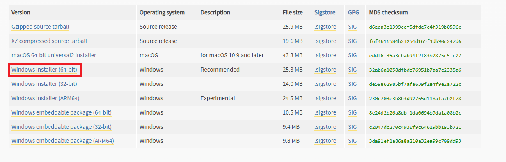
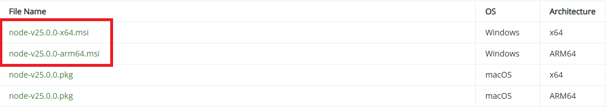
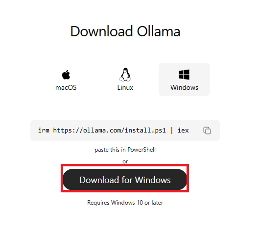
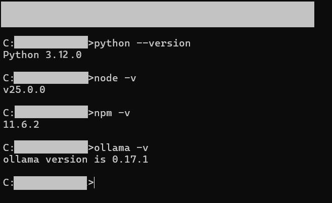
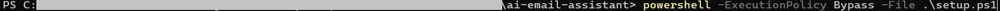
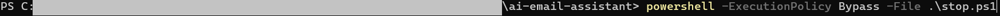
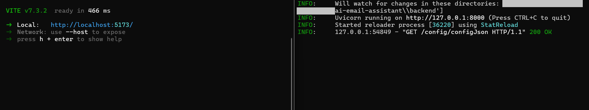
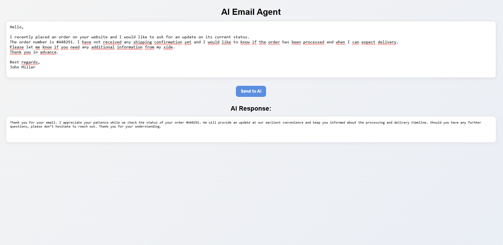
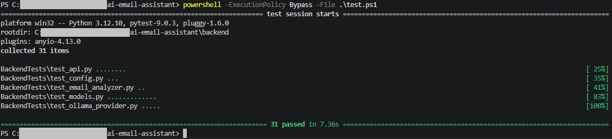

## 🤖 AI Email Agent 
AI Email Agent is a project that automatically generates replies to emails using a local LLM model powered by Ollama. It combines a Python backend with a modern frontend to demonstrate how AI agents can be integrated into real-world applications without relying on external APIs.

## 📸 Screenshots
### Installation

### Setup, Start, Stop

### How it looks after installations, setup and start

### Testing

## 🚀 Quick Start 
**First, download the ZIP folder of this project and then extract it.** 
## ⚙️ Requirements
### To run this project, you need:
- Python 3.12.x (recommended 3.12.10)
- Node.js 25.x (recommended 25.0.0)
- npm 11.6.2 (recommended)
- Ollama 0.17.1 (recommended)
- Ollama installed locally
- At least 8–10 GB of RAM for the AI model and 5.2GB of free disk space
- Windows 11 (I did not test the project on difrent OS or other versions of Windows)

### This project was tested on:
- Python 3.12
- Node.js 25.0.0
- npm 11.6.2
- Ollama 0.17.1 and 0.21.1
- Windows 11
- Edge browser

## 📦 Installation 
### Python
1. https://www.python.org/downloads/release/python-3120/
2. Download Windows installer (64-bit)
3. Run the installer and install Python (make sure to check “Add Python to PATH”)
4. Check if the python is installed correctly with `python --version` in cmd 

### Node.js (npm included): 
1. https://nodejs.org/en/download/archive/v25.0.0
2. Download node-v25.0.0-arm64.msi
3. Start the installer and install node.js + npm
4. Check if the Node.js is installed correctly with `node -v` in cmd
4. Check if the npm is installed correctly with `npm -v` in cmd 

### Ollama: 
1. https://ollama.com/download
2. Click on download button (choose Ollama for Windows)
3. Start the installer and install Ollama
4. Check if the Ollama is installed correctly with `ollama -v` in cmd 

**Then run the automated setup script (run this onle once, run in project root folder in powershell):** 
`powershell -ExecutionPolicy Bypass -File .\setup.ps1`

### This script will:
- Install the required LLM model (Qwen via Ollama)
- Create a Python virtual environment
- Install backend dependencies
- Set up the frontend using Vite
- Prepare all required project files

## ▶️ Running the Project 
**Wait until the setup complete. Then Start the application with (run in project root folder in powershell):** 
`powershell -ExecutionPolicy Bypass -File .\start.ps1`

**Then open in your browser:** 
http://localhost:5173/

## ⛔ Stopping the Project
**To stop all running services (run in project root folder in powershell):** 
`powershell -ExecutionPolicy Bypass -File .\stop.ps1`

## 🧠 Features
- AI-powered email response generation
- Local LLM processing (Ollama, no external API required)
- Fast frontend-backend communication
- Asynchronous request handling
- Fully local and private AI execution

## ⚙️ Configuration 
**Backend configuration includes:**
- API backend URL
- model selection

**Frontend loads backend configuration from:** 
http://localhost:8000/config/configJson

## 🧪 Testing
- Unit tests (services, config, models)
- API tests (FastAPI endpoints)
- Mocking external dependencies (AI provider, filesystem)

**Backend tests can be run using (run in project root folder in powershell):** 
`powershell -ExecutionPolicy Bypass -File .\test.ps1`

## 🧠 How It Works (High-Level)
1. The user writes an email in the frontend interface
2. The frontend sends the request to the backend API
3. The backend forwards the prompt to the Ollama LLM
4. The model generates a response
5. The backend returns the AI-generated reply to the frontend

## 📌 Technologies Used
- Python
- FastAPI
- Uvicorn
- Requests
- Python-dotenv
- Concurrent_log_handler
- Pytest
- httpx (HTTP client, BSD licence)
- Node.js
- Vite
- Vanilla JavaScript
- Ollama (local LLM runtime)
- qwen3:8b model

**⚠️ This project uses qwen3:8b LLM model via Ollama, which is licensed under the Apache License 2.0. The model is developed and maintained by its respective authors.**

## 🔁Main Data Flow
1. Frontend (user enters email in UI) → POST request to backend API at /email/reply.
2. apiEmail.py (receives request, validates data using modelsEmail.py).
3. emailAnalyzer.py (calls generate_reply, uses config from config.json).
4. ollamaQwen3.py (sends prompt to local Ollama API at http://localhost:11434/api/generate, receives response).
5. Back through the same path: ai → services → api → Frontend (displays AI response).

## 📜 License 
MIT License

## 👤 Author 
Name: VitekChvat 
GitHub: https://github.com/VitekChvat 
Contact: vitekchvat.dev@gmail.com

## 💡 Motivation
**This project was created to explore:**
- automation of communication using AI
  local LLM execution without cloud APIs
- building AI agent architectures
- combining backend + frontend in a full-stack AI system
- learning APIs and how to navigate a larger project than I usually work on
- learning basic testing in python with pytest

## ⚠️ Known Issues
- high RAM usage due to local LLM
- first response may be slow (model loading)
- `.ps1` scripts may be blocked by your antivirus and might not work properly
- your Vite server may run on a different port than the default one (http://localhost:5173/)
- If the setup, start, or stop scripts are not working, you may not be running them from the root folder
- Always use the same folder that you extracted

## ⚠️ Warning
- Do not worry if some folders are missing (for example "frontend" and "PowerShellPIDs" folders). They will be added during setup and start.
- The PowerShell PIDs folder is cleared automatically after each stop process.
